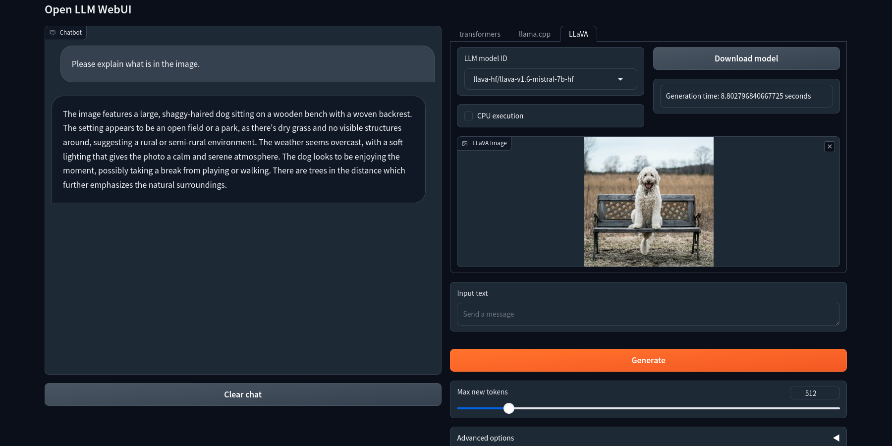

# Open LLM WebUI

This repository contains a web application designed to execute relatively compact, locally-operated Large Language Models (LLMs).

## Installation

Please follow these steps to install the software:

* Create a new conda environment:
```bash
conda create -n ollm python=3.10
conda activate ollm
```

* Clone the software repository:
```bash
git clone https://github.com/Uminosachi/open-llm-webui.git
cd open-llm-webui
```

### Python Package Installation

#### General Instructions
* Install the necessary Python packages by executing:
  ```bash
  pip install -r requirements.txt
  ```

#### Platform-Specific Instructions
* **For Windows (with CUDA support):**
  - Install [Visual Studio](https://learn.microsoft.com/ja-jp/visualstudio/install/install-visual-studio?view=vs-2022):
    - ⚠️ Important: Make sure to select `Desktop development with C++` during the installation process.
  - Copy MSBuild extensions for CUDA as an administrator (adjust the CUDA version as necessary):
    ```bash
    xcopy /e "C:\Program Files\NVIDIA GPU Computing Toolkit\CUDA\v11.8\extras\visual_studio_integration\MSBuildExtensions" "C:\Program Files\Microsoft Visual Studio\2022\Community\MSBuild\Microsoft\VC\v170\BuildCustomizations"
    ```
  - Configure the required environment variables for the build (adjust the CUDA version as necessary):
    ```bash
    set PATH=C:\Program Files\NVIDIA GPU Computing Toolkit\CUDA\v11.8\bin;%PATH%
    "C:\Program Files\Microsoft Visual Studio\2022\Community\VC\Auxiliary\Build\vcvars64.bat"
    set FORCE_CMAKE=1 && set CMAKE_ARGS="-DLLAMA_CUDA=on"
    ```
  - Install the necessary Python packages (this process may take some time):
    ```bash
    pip install ninja cmake scikit-build-core[pyproject]
    pip install --force-reinstall --no-cache-dir llama-cpp-python
    pip install -r requirements.txt
    ```

* **For Linux (with CUDA support):**
  - Configure the required environment variables for the build (if not already set):
    ```bash
    export PATH=/usr/local/cuda/bin:${PATH}
    ```
  - Install the necessary Python packages:
    ```bash
    CMAKE_ARGS="-DLLAMA_CUDA=on" pip install --force-reinstall --no-cache-dir llama-cpp-python
    pip install -r requirements.txt
    ```

* **For Mac OS (without CUDA support):**
  - Install the necessary Python packages:
    ```bash
    BUILD_CUDA_EXT=0 pip install -r requirements.txt
    ```

## Running the application

```bash
python ollm_app.py
```

* Open http://127.0.0.1:7860/ in your browser.

## Downloading the Model

To download the model:
* Launch this application.
* Click on the "Download model" button next to the LLM model ID.
* Wait for the download to complete.

### Model List (transformers)

| Provider      | Model Names                                                                                |
|---------------|--------------------------------------------------------------------------------------------|
| Microsoft     | Phi-3-mini-4k-instruct, Phi-3-mini-128k-instruct                                           |
| Google        | gemma-1.1-2b-it, gemma-1.1-7b-it                                                           |
| NVIDIA        | Llama3-ChatQA-1.5-8B                                                                       |
| Apple         | OpenELM-1_1B-Instruct, OpenELM-3B-Instruct                                                 |
| Rakuten       | RakutenAI-7B-chat, RakutenAI-7B-instruct                                                   |
| rinna         | youri-7b-chat, bilingual-gpt-neox-4b-instruction-sft, japanese-gpt-neox-3.6b-instruction-sft-v2 |
| TheBloke      | Llama-2-7b-Chat-GPTQ, Kunoichi-7B-GPTQ                                                     |
| Stability AI  | stablelm-tuned-alpha-3b, stablelm-tuned-alpha-7b, japanese-stablelm-instruct-beta-7b       |

* 🔍 Note: The downloaded model file will be stored in the `.cache/huggingface/hub` directory of your home directory.
* Please check the license in the **Model Credit** section below.

#### Access and Download Models
* Ensure you have obtained the necessary access rights via Hugging Face before downloading any models. Visit the following pages to obtain access:
  - [Gemma model by Google](https://huggingface.co/google/gemma-1.1-2b-it), [Llama 2 model by Meta](https://huggingface.co/meta-llama/Llama-2-7b-hf), [Llama 3 model by Meta](https://huggingface.co/meta-llama/Meta-Llama-3-8B)

#### Login to Hugging Face
* Before downloading any models, please log in via the command line using:
  ```
  huggingface-cli login
  ```

### Model List (llama.cpp)

| Provider      | Model Names                                                                                |
|---------------|--------------------------------------------------------------------------------------------|
| Microsoft     | Phi-3-mini-4k-instruct-q4.gguf, Phi-3-mini-4k-instruct-fp16.gguf                           |
| TheBloke      | llama-2-7b-chat.Q4_K_M.gguf                                                                |
| QuantFactory  | Meta-Llama-3-8B-Instruct.Q4_K_M.gguf                                                       |

#### Using any GGUF file
* 🔍 File Placement: Place files with the `.gguf` extension in the `models` directory within the `open-llm-webui` folder. These files will then appear in the model list on the `llama.cpp` tab of the web UI and can be used accordingly.
* 📝 Metadata Usage: If the metadata of a GGUF model includes `tokenizer.chat_template`, this template will be used to create the prompts.

## Usage

* Enter your message into the "Input text" box. Adjust the slider for "Max new tokens" as needed.
* Under "Advanced options", adjust the settings for "Temperature", "Top k", "Top p", and "Repetition Penalty" as needed.
* Press "Enter" on your keyboard or click the "Generate" button.
   - ⚠️ Note: If the cloud-based model has been updated, it may be downloaded upon execution.
* If you click the "Clear text" button, the chat history will be cleared.

### transformers tab
* By enabling the `CPU execution` checkbox, the model will use the argument `device_map="cpu"`.

### llama.cpp tab
* Use the radio buttons in the `Default chat template` to select the template that will be used if the GGUF model lacks a `chat_template`.

### options
* When you enable the `Translate (ja->en/en->ja)` checkbox:
   - Any input in Japanese will be automatically translated to English, and responses in English will be automatically translated back into Japanese.
   - ⚠️ Note: Downloading the translation model for the first time may take some time.

<br>



## Model Credit

| Developer           | Model                        | License                                                        |
|---------------------|------------------------------|----------------------------------------------------------------|
| Microsoft           | Phi-3                        | [The MIT License](https://opensource.org/licenses/MIT)         |
| Google              | Gemma                        | [Gemma Terms of Use](https://ai.google.dev/gemma/terms)        |
| NVIDIA              | Llama3-ChatQA                | [Llama 3 Community License](https://huggingface.co/meta-llama/Meta-Llama-3-8B/blob/main/LICENSE) |
| Apple               | OpenELM                      | [Apple sample code license](https://huggingface.co/apple/OpenELM-1_1B-Instruct/blob/main/LICENSE) |
| Rakuten             | RakutenAI                    | [Apache License 2.0](https://huggingface.co/datasets/choosealicense/licenses/blob/main/markdown/apache-2.0.md) |
| rinna               | Youri                        | [Llama 2 Community License](https://ai.meta.com/llama/license/) |
| rinna               | Japanese GPT-NeoX            | [The MIT License](https://opensource.org/licenses/MIT)         |
| Meta AI             | Llama 2                      | [Llama 2 Community License](https://github.com/facebookresearch/llama/blob/main/LICENSE) |
| Sanji Watsuki       | Kunoichi-7B                  | [CC-BY-NC-4.0](https://spdx.org/licenses/CC-BY-NC-4.0)         |
| Stability AI        | StableLM                     | [Apache License 2.0](https://github.com/Stability-AI/StableLM/blob/main/LICENSE) |
| Stability AI        | Japanese-StableLM-Instruct   | [Japanese Stablelm Research License Agreement](https://huggingface.co/stabilityai/japanese-stablelm-instruct-alpha-7b/blob/main/LICENSE) |
