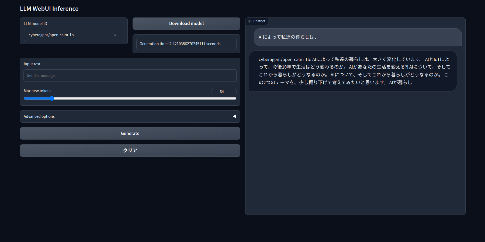

# LLM WebUI Inference

This repository contains a web application designed to execute Large Language Models (LLMs), such as the [Open CALM model](https://huggingface.co/cyberagent), developed by [CyberAgent, Inc.](https://www.cyberagent.co.jp/).

## Installation

Please follow these steps to install the software:

1. Create a new conda environment:

```bash
conda create -n calm python=3.10
conda activate calm
```

2. Clone the software repository:

```bash
git clone https://github.com/Uminosachi/open-calm-webui.git
cd open-calm-webui
```

3. Install the required Python packages:

```bash
pip install -r requirements.txt
```

If you are using CUDA 11.7 or CUDA 11.8 or macOS, please use a file with the corresponding suffix (_cu117, _cu118, _mac) instead of the previous one.

## Running the application

```bash
python ocalm_app.py
```

* Open http://127.0.0.1:7860/ in your browser.

## Downloading the Model

To download the model:

1. Launch this application.
2. Click on the "Download model" button next to the Open CALM model ID.
3. Wait for the download to complete.
4. The downloaded model file will be stored in the `.cache/huggingface/hub` directory of your home directory.

## Usage

* Enter your message in the Input text box.
* Adjust the values of Max New Tokens, Temperature, Top k, Top p and Repetition penalty as necessary.
* Press Enter on your keyboard or click the "Generate" button.



## Model Credit

* **Developed by**: [CyberAgent, Inc.](https://www.cyberagent.co.jp/)
* **Model type**: Transformer-based Language Model
* **Language**: Japanese
* **Library**: [GPT-NeoX](https://github.com/EleutherAI/gpt-neox)
* **License**: OpenCALM is licensed under the Creative Commons Attribution-ShareAlike 4.0 International License ([CC BY-SA 4.0](https://creativecommons.org/licenses/by-sa/4.0/)). When using this model, please provide appropriate credit to CyberAgent, Inc.
  * Example (en): This model is a fine-tuned version of OpenCALM-XX developed by CyberAgent, Inc. The original model is released under the CC BY-SA 4.0 license, and this model is also released under the same CC BY-SA 4.0 license. For more information, please visit: https://creativecommons.org/licenses/by-sa/4.0/
  * Example (ja): 本モデルは、株式会社サイバーエージェントによるOpenCALM-XXをファインチューニングしたものです。元のモデルはCC BY-SA 4.0ライセンスのもとで公開されており、本モデルも同じくCC BY-SA 4.0ライセンスで公開します。詳しくはこちらをご覧ください: https://creativecommons.org/licenses/by-sa/4.0/
